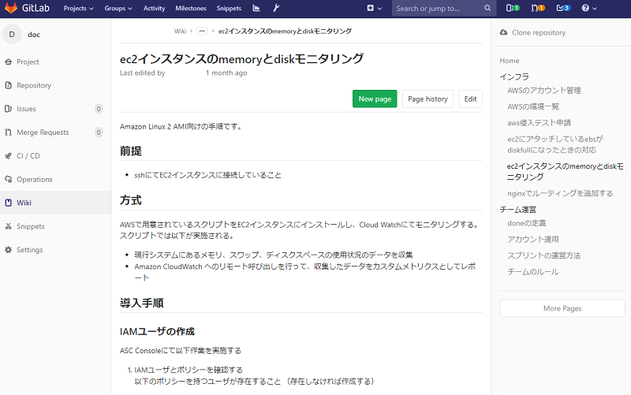

# スクラム開発における開発環境スタックの活用について

複数ロケーションに跨ったスクラムチームでの開発におけるスクラムイベントや日々の活動において、開発環境スタックの各ツールをどのように活用しているのかを紹介します。

どのスクラムイベント・日々の活動で主にどのツールを活用しているのか表にまとめてみました。

||JIRA|GitLab|Nexus|Slack|Zoom|
|---|---|---|---|---|---|
|スプリント計画|○|||○|○|
|デイリースクラム|○||||○|
|スプリントレビュー|○||||○|
|ふりかえり||||○|○|
|実装||○|○|||
|レビュー||○||||
|ドキュメンテーション||○||||
|日々のコミュニケーション||||○|○|

## スプリント計画

### バックログ

- 使用ツール：JIRA、Zoom

バックログの管理にはJIRAを使用しています。

ロケーションが離れていない場合は、メンバーがミーティングスペースに集まり同じ画面を見ながらバックログの共有を行うことが多いと思われます。

しかしロケーションが離れている場合でも、Zoomで拠点間を繋ぎながら画面共有を用いてバックログやタスクをメンバーで共有することによって実施できます。

- バックログの画面例

### プランニングポーカー

- 使用ツール：Slack、Zoom

プロダクトバックログアイテムの見積もりはプランニングポーカーで行っています。

プランニングポーカーとは、「1、2、3、5……」といった数字が書かれたカードを使って、
タスクの規模を相対的に見積もる手法です。

ロケーションが離れていない場合は、メンバーが集まりそれぞれのタスクに対して
思いのままに数字のカードを出し合っていました。

ロケーションが離れている場合でも、プロダクトバックログアイテムのタイトルをコピーしてSlackに貼り付け  
Zoom上の会話で合図を出してメンバーが一斉に数字のリアクションをつけることで実施が可能です。

視覚的にもどの数字が一番多いか一目瞭然のため、ロケーションが離れているいないに関わらず使用してもよいでしょう。

- Slackでのプランニングポーカーの例

## デイリースクラム

- 使用ツール：JIRA、Zoom

Zoomで拠点間をつなぎ、画面共有とビデオ通話を用いてデイリースクラムをします。

デイリースクラムではJIRAのタスクを見ながら各自、次の事項を共有します。

- 開発チームがスプリントゴールを達成するために、私が昨日やったことは何か？
- 開発チームがスプリントゴールを達成するために、私が今日やることは何か？
- 私や開発チームがスプリントゴールを達成する上で、障害となる物を目撃したか？

参考:

- https://scrumguides.org/docs/scrumguide/v2017/2017-Scrum-Guide-Japanese.pdf 「デイリースクラム」のセクション

## スプリントレビュー

- 使用ツール：JIRA、Zoom

Zoomで拠点間をつなぎ、スプリントの状況をJIRAのバックログを見ながら報告とデモをしていきます。

AndroidやiPhone等の実機を使用してデモを行う場合は、他拠点のメンバーにも見えるように意識しましょう。

## ふりかえり

- 使用ツール：Slack、Zoom

ふりかえりはKPTで行っています。KPTは、Keep、Problem、Tryの略です。

Keepは良かったこと、続けたいこと、Problemは悪かったこと、問題だと感じていること、Tryは次に試したいことをあげます。

参考：[ふりかえりガイド](http://objectclub.jp/download/files/pf/RetrospectiveMeetingGuide.pdf)　(外部サイト)

ロケーションが離れていない場合は、模造紙と付箋を利用してKPTを行っていました。  
各々が付箋にKeepを書き、内容を共有、Problemを付箋に書き、共有…といった流れです。

ロケーションが離れている場合はSlackとZoomを用いることで実施が可能です。

後からの見返しやすさを考慮し、SlackにKPT用のチャンネルを用意します。  
そしてKPT用チャンネルにKeep、Problem、Tryの順に各々上げていきます。

共感できるコメントがあればスタンプで反応します。  
こうすることで発言が苦手な人もリアクションがとりやすくなります。

- SlackでのKPTの例

## 実装

### CI

- 使用ツール：GitLab（GitLab CI）

GitLab CIを使って、開発者がコミットするごとに自動でビルドやテストを実施するようにしています。

Merge Requestを作成した際にもCIが自動で走るようになっており、  
ビルドやテストが通らない状態かどうかがすぐにわかるため、レビュー時の余計な手間も減ります。

ロケーションが離れているからこそCIで常にソースコードのバグや問題を監視し、  
別拠点の修正によって開発が進まなくなる等の余計なコミュニケーションコストを減らすことが大事になってきます。

### 成果物の共有

- 使用ツール：Nexus

プロジェクトで使用するライブラリや成果物をNexusを使って管理しています。

VPNで保護された環境にNexusを置くことで、ロケーションが離れていてもVPN経由で安全に成果物を共有できます。

## レビュー

- 使用ツール：GitLab（Merge Request）

レビューはGitLabのMerge Requestで実施します。

- 例：Merge Request画面

レビューイはブランチを切ってソースコードを修正し、GitLabのMerge Requestを使用してレビュー依頼を出します。

レビューアはMerge Requestを確認して、指摘があればGitLab上にコメントを書きます。

GitLab上のみでレビューのやり取りが行えるため、レビューアとレビューイのロケーションが異なっていてもレビューを行えます。

- 例：レビュー時のコメント

## ドキュメンテーション

- 使用ツール：GitLab（Wiki）

ドキュメントの共有はGitLabのWikiの機能を使用しています。

主に環境構築の手順やチームで共有したほうがよいノウハウなどを残しています。

ロケーションが離れていても、手順やドキュメントの連携をWikiのURLをSlackで伝えるだけで済むので便利です。

- 例：Wiki画面

## 日々のコミュニケーション

- 使用ツール：Slack、Zoom

コミュニケーション全般として、SlackとZoomを利用しています。

Slackは、チームのチャンネルや独り言チャンネルでコミュニケーションをとります。

「独り言チャンネル」とは、各メンバーに用意する自分専用のチャンネルです。 チャンネルはオープンにして誰もが見られるようにし、「これからやろうとしていること」や「やってみて感じたこと」、「難しくて詰まっているところ」などを不定期に書き込みます。

こうすることでロケーションが離れていても存在感が出せますし、「難しくて詰まっているところ」を素直に呟いてみると解決策を知っているメンバーが助け舟を出してくれたりします。

- 例：独り言チャンネル

また、ロケーションが離れているといつ出社/退社したかどうかがわからないため「勤怠チャンネル」を作り、出社/退社や休みの連絡をとるように工夫をしています。

- 例：勤怠チャンネル

Zoomは、スクラムイベントや簡易なミーティング、ペアプログラミングの際に使用します。  
画面共有やビデオ通話、ホワイトボードの共有もできるため、ロケーションが離れていても円滑にコミュニケーションをとることができます。
