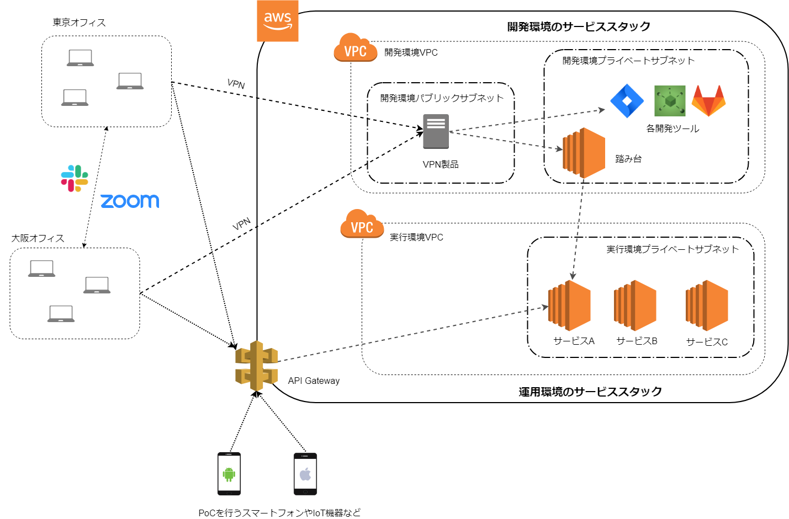

# 環境の全体構成

我々が使用している環境を図にまとめました。

AWS上は開発環境VPCと実行環境VPC、2つのVPCがあります。
2つのVPCはVPCピアリングで接続されています。

実行環境に置かれたアプリケーションに何らかの脆弱性があり、そこから開発環境へ侵入してソースコードなどを取得されるといったことを防ぐため、接続を開始できる方向を開発環境VPCから実行環境VPCのみに限定しています。
逆方向では接続を開始できません。

開発環境VPCにはパブリックサブネットとプライベートサブネットがあります。
パブリックサブネットにはVPN接続を行うための製品が置かれています。
プライベートサブネットにはJIRAやGitLabといった開発ツールと踏み台サーバーが置かれています。
開発ツールについては後述します。
踏み台サーバーは実行環境へSSHでアクセスするために置かれています。

実行環境VPCにはプライベートサブネットがあり、PoCなどでアクセスするためのWeb APIが置かれます。
Web APIをメンテナンスするためには開発環境VPCの踏み台サーバーを経由してアクセスします。
インターネットからWeb APIへHTTPでアクセスするためには、API Gatewayを経由します。

PoCを実施する際はスマートフォンやIoT機器からインターネット越しにHTTP通信が行われます。
実行環境に置かれたアプリケーションの認証処理に脆弱性があり、不正にアクセスされることを防ぐため、アプリケーションの認証処理とは別にAPI GatewayでもAPIキーによる認証を行っています。

---

次のドキュメントは[開発環境・実行環境のサービススタック紹介](./tools.md)です。

