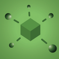

# 開発環境・実行環境のスタック紹介

## 開発環境のスタック

ここでは我々が複数ロケーションに跨るチームで開発を推進するために活用しているツールについて簡単に紹介します。

いずれのツールも機能が十分であることは当然のことながら、いくつかのツールについてはアクセス制御や侵入者対策などの観点からVPN経由で使用する必要があったため、自分たちの環境へインストール可能であることも選定のポイントになりました。

### JIRA

- https://ja.atlassian.com/software/jira

Atlassianという企業が提供しているプロジェクト管理のソフトウェアです。

バックログの管理をしたり、かんばん形式で表示させてスクラムイベントでの情報共有に使用しています。

サービスとしても提供されていますが、我々はVPNを介してアクセスできるプライベートサブネット上にサーバー版をインストールして使用しています。

### GitLab

- https://about.gitlab.com/

バージョン管理システムです。

サービスとしても提供されていますが、我々はJIRAと同じくVPNを介してアクセスできるプライベートサブネット上にインストールして使用しています。

GitLabはバージョン管理の機能以外にもCIの機能を持っており、我々はそのCI機能でソースコードをビルドして、後述するNexusへのデプロイなども行っています。

### Nexus

- https://www.sonatype.com/nexus-repository-oss

プライベートなMavenリポジトリやDockerレジストリを構築できるソフトウェアです。

我々は主に成果物のデプロイ先として使用しています。

こちらもJIRAやGitLabと同じようにVPNを介してアクセスできるプライベートサブネット上にインストールして使用しています。

### Zoom

- https://zoom.us/jp-jp/meetings.html

PCやスマートフォンでビデオ会議が出来るサービスです。

スクラムイベントの際はZoomで各拠点を繋いで会話をしています。
手軽に使用できますし、画像・音声共に高品質でストレスなくビデオ会議ができています。

### Slack

- https://slack.com/

チャットサービスです。

日々のコミュニケーションで使用する主たるツールです。

## 実行環境のスタック

### API Gateway

AWSが提供しているサービスです。

- https://aws.amazon.com/jp/api-gateway/

我々が開発する各サービスそのものにも認証は存在しますが、API Gateway自体でもAPIキーによる認証を行えるのでサービスの開発状況によらずセキュリティを担保できます。

スマートフォンやIoT機器から送信されるHTTPリクエストはAPI Gatewayを経由して実行環境のプライベートサブネットにあるサービスへ到達します。
サービスはSpring Bootで構築されており`java`コマンドで実行されているものや、Ruby on Railsで構築されておりDockerで実行されているものなど様々です。

---

次のドキュメントは[スクラム開発における開発環境スタックの活用について](./scrum.md)です。

